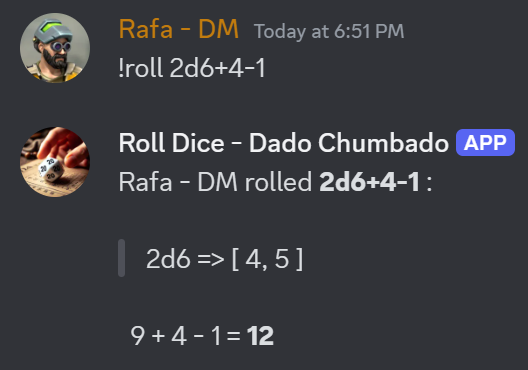
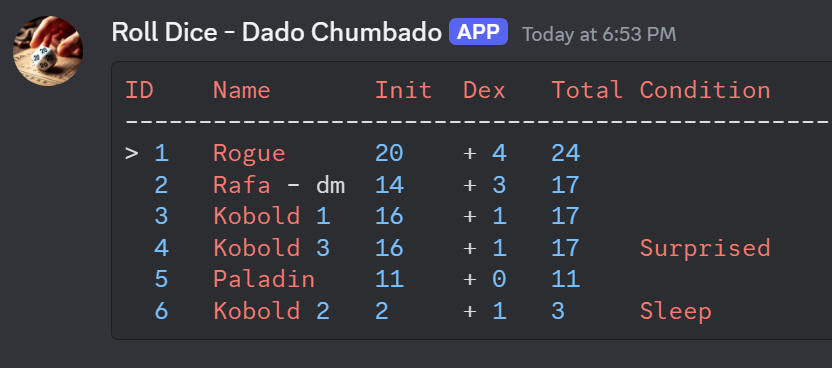
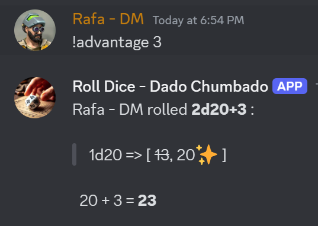
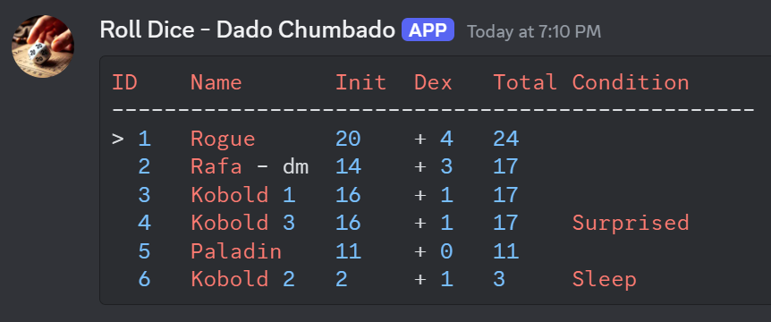

# Discord bot to roll dice and control initiative table

:game_die: This Discord bot allows users to roll various types of dice for tabletop RPG games like Dungeons & Dragons. It supports standard rolls, private rolls, advantage, disadvantage, and more. The bot can be customized to suit different dice systems and constraints.
Features

- Standard Dice Rolls: Roll any combination of dice (e.g., 2d6, 1d20+5, 3d6-1d4, d100). 
- Private Rolls: Send dice results directly on private messages. 
- Advantage/Disadvantage Rolls: Automatically roll two or three d20s and choose the higher or lower result. 
- Critical Rolls: Roll dice maximizing the first die and roll the rest.
- Control Initiative Table: Add or remove characters from the initiative table.
- Custom Limits: Configure dice limits (max number of dice and die size) through environment variables.







## Installation

Clone the repository:

```bash
git clone https://github.com/Dado-Chumbado/roll-dice-dnd.git
cd roll-dice-dnd

cp .env.example .env
cp config.json.example config.json
```

### Configure Environment Variables

This ensures the app runs using the environment managed by Poetry.

Set up environment variables: Configure your .env file to set limits on dice rolls (optional):

```env
DISCORD_TOKEN=your_discord_bot_token 
``` 

Install dependencies: Make sure you have Python 3.8+ installed. Install the required packages with:

### 1. Install Poetry

To install Poetry, run the following command (make sure Python is already installed):

```bash
curl -sSL https://install.python-poetry.org | python3 -
```

Or, use pip:

```bash
pip install poetry
```

### 2. Install Dependencies

To install dependencies specified in your pyproject.toml file:

```bash
poetry install
```

This will create a virtual environment and install all the necessary packages.

### 3. Activate the Virtual Environment

Poetry automatically manages a virtual environment. To activate it:

```bash
poetry shell
```

This opens a shell within the environment where you can run your app.


### 4. Configure the commands in config.json (Optional)

Edit the config.json file to configure the commands and limits.

There you can change the activation char and the commands for each type of roll.

See the #Customization section for more details.

### 5. Run the App

You can run the bot after configuring the environment. You can run it within the Poetry environment like this:

```bash
poetry run python main.py
```

# Usage

Once the bot is running, invite it to your Discord server. Use the following commands to roll dice.

## Roll Commands

#### Standard Dice Roll:
Roll any combination of dice (default is 1d20 if no arguments are passed).

```bash
!roll d20
```
```bash
Rafa - DM rolled 1d20 : 

1d20 => [ 9 ]

  9 = 9
```

Using a custom number of dice and modifier:
```bash
!roll 3d6+8
```
```bash
Rafa - DM rolled 3d6+8 : 

3d6 => [ 1!, 3, 3 ]

  7 + 8 = 15
```

Using a custom die size with subtraction operation: 

```bash
!roll 1d8-1d5+1
```
```bash
Rafa - DM rolled 1d8-1d5+1 : 

1d8 => [ 5 ]
1d5 => [ 4 ]

  5 - 4 + 1 = 2
```

Rolling multiple dice:

```bash
!roll 5d10+4d6+2d8-3d5+4
```

```bash
Rafa - DM rolled 5d10+4d6+2d8-3d5+4 : 

5d10 => [ 3, 4, 9, 5, 2 ]
4d6 => [ 2, 4, 1!, 4 ]
2d8 => [ 5, 7 ]
3d5 => [ 3, 3, 4 ]

  23 + 11 + 12 - 10 + 4 = 40
```

#### Private Roll for the DM:
Send dice rolls to your private messages.

```bash
!dm_roll d20+5
````

#### Critical Damage Roll:
Roll with critical damage, that maximize the first dice and roll the rest.

```bash
!critical_damage d8+5
```
```bash
Rafa - DM rolled 1d8+5 : 

2d8 => [ 8!, 5 ]

  13 + 5 = 18
```

#### Roll with Advantage:
Roll with advantage using two d20s, keeping the highest result.

```bash
!advantage 5
```
```bash
Rafa - DM rolled 2d20+5 : 

1d20 => [ 13, ~~3~~ ]

  13 + 5 = 18
```

```bash
!advantage d4+2
```
```bash
Rafa - DM rolled 2d20+1d4+2 : 

1d20 => [ 16, ~~11~~ ]
1d4 => [ 1! ]

  16 + 1 + 2 = 19
 ```

#### Roll with Double Advantage:
Roll with three d20s, keeping the highest result.

```bash
!double_advantage
````
```bash
Rafa - DM rolled 3d20 : 

1d20 => [ 16, ~~7~~, ~~4~~ ]

  16 = 16
```


#### Roll with Disadvantage:
Roll with disadvantage, keeping the lowest result.

```bash
!disadvantage
```
```bash
Rafa - DM rolled 2d20 : 

1d20 => [ 4, ~~5~~ ]

  4 = 4
```

# Initiative table

It's a simple table that keeps track of initiative. The table can be reset, displayed, and manipulated (e.g., adding or removing characters).

- Initiative Table: Maintains a list of characters with their initiative roll and dexterity bonus, along with optional conditions. The table can be reset, displayed, and manipulated (e.g., adding or removing characters). 
- Advantage Rolls: Handles special initiative rolls where the player can roll with advantage. 

#### Commands:

- roll_initiative: Rolls initiative for a character, with options for advantage and repeated rolls. 
- roll_reset_initiative: Resets the initiative table, clearing all entries. 
- remove_initiative: Removes an entry from the initiative table based on an index.
- force_initiative: Manually adds a character to the initiative table, specifying their dice roll and dexterity modifier.
- add_condition_initiative: Adds a condition (e.g., status effect) to a character in the initiative table. 
- remove_condition_initiative: Removes a condition from a character in the initiative table. 
- next_initiative: Advances to the next character in the initiative order. 
- prev_initiative: Moves back to the previous character in the initiative order.

## Table Display:

The show method generates a formatted table displaying the current initiative order, including characters' names, initiative rolls, dexterity modifiers, total values, and conditions. The current character is highlighted with a >.



#### Roll initiative:
The default mode to roll initiative is passing the dexterity modifier to the command.
The name will be filled in automatically based on the user's name.
```bash
!initiative 5
```
To force a different name, pass it in the command:
```bash
!initiative 5 Name
```

It's also possible to roll the initiave with advantage:

```bash
!advantage_initiative 4
```


And for the DM to roll several times using one command:
```bash
!initiative 2 Monster_name 4
```
Where: 
- 2 is the initiative roll
- Monster_name is the name of the character
- 4 is the quantity of rolls

All the monsters will have and be named with the additional <number> in their name.

Also to force initiatives, you can use the !force_initiative command.

```bash
!force_initiative 12 2 Player 
```
Where:
- 12 is the initiative rolled in the die
- 2 is the dexterity modifier
- Player is the name of the character

To remove a character from the initiative table, use the !remove_initiative command passing the index to be removed.
```bash
!remove_initiative 3
```

The commands `next` and `previous` will advance or move back to the next or previous character in the initiative table.

To add or remove conditions from characters in the initiative table, use the !add_condition_initiative and !remove_condition_initiative commands.

And finally to reset the initiative table, use the !reset_initiative command.

# Customization
Command Configuration

You can modify the available commands by editing the config.json file:

```json
{
    "roll": {
        "default": "roll",
        "advantage": "advantage",
        "double_advantage": "double_advantage",
        "disadvantage": "disadvantage",
        "dm_roll": "dm_roll",
        "critical_damage": "critical_damage"
    },
    "initiative": {
        "default": "initiative",
        "advantage": "advantage_initiative",
        "force": "force_initiative",
        "reset": "reset_initiative",
        "remove": "remove_initiative",
        "next": "next",
        "previous": "previous",
        "add_condition": "add_condition",
        "remove_condition": "remove_condition"
    },
    "stats": {
        "player": "my-stats",
        "session": "session-stats"
    }
}
```

#### Dice Limits

Set dice limits by modifying environment variables in the .env file:

    Max number of dice per roll: Set using limit_of_dice_per_roll.
    Max die size: Set using limit_of_die_size.
```env
limit_of_dice_per_roll=40
limit_of_die_size=1000
```

To change the activation command, modify the in the .env file and restart the container.
```env
command_char=!
```

:exclamation:  it's not recommended to use `/` as activation character, since Discord will try to map as slash command.

## Database statistics [alpha]

To activate the database statistics, set the `database` environment variable to `true` in the .env file.

In the first roll, the database table will be created.

To access the database statistics, each player can use the `!stats` command.
To get the session statistics, use the `!session-stats` command.

## Testing

To execute tests, run `poetry run pytest` in the terminal.


Contributing

Feel free to contribute by submitting a pull request or opening an issue if you find a bug or have a feature request.
License

This project is licensed under the MIT License. See the LICENSE file for more details.