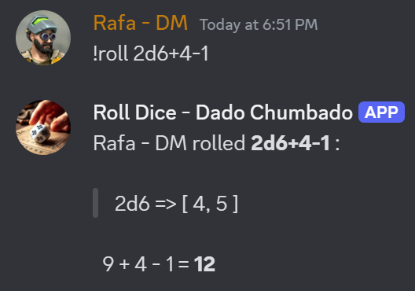
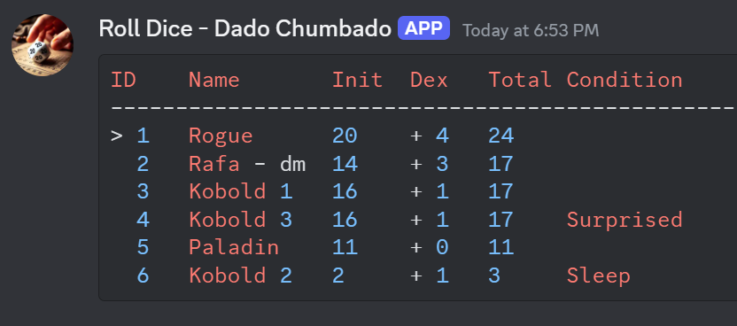
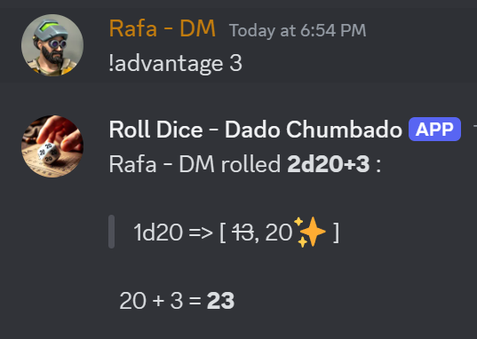
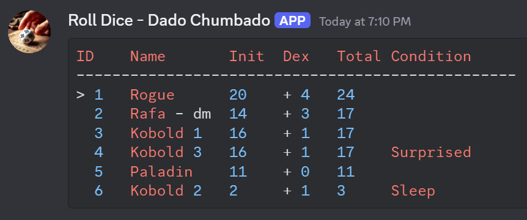

# Discord & Telegram bot to roll dice and control initiative table

:game_die: This bot allows users to roll various types of dice for tabletop RPG games like Dungeons & Dragons. It supports standard rolls, private rolls, advantage, disadvantage, and more. Available for both **Discord** and **Telegram**.

Features

- Standard Dice Rolls: Roll any combination of dice (e.g., 2d6, 1d20+5, 3d6-1d4, d100).
- Private Rolls: Send dice results directly on private messages (Discord only).
- Advantage/Disadvantage Rolls: Automatically roll two or three d20s and choose the higher or lower result.
- Critical Rolls: Roll dice maximizing the first die and roll the rest.
- Control Initiative Table: Add or remove characters from the initiative table (Discord only).
- NPC Initiative: Roll initiative for multiple NPC groups in a single command (Discord only).
- Reaction Controls: Control the initiative table via emoji reactions on the table message (Discord only).
- Custom Limits: Configure dice limits (max number of dice and die size) through environment variables.
- **Character Sheet Management**: Import D&D Beyond character sheets via PDF, track HP, spell slots, and inventory during sessions (Discord + Telegram).







## Installation

Clone the repository:

```bash
git clone https://github.com/Dado-Chumbado/roll-dice-dnd.git
cd roll-dice-dnd

cp .env.example .env
cp config.json.example config.json
```

### Configure Environment Variables

This ensures the app runs using the environment managed by Poetry.

Set up environment variables: Configure your .env file to set limits on dice rolls (optional):

```env
DISCORD_TOKEN=your_discord_bot_token
```

Install dependencies: Make sure you have Python 3.8+ installed. Install the required packages with:

### 1. Install Poetry

To install Poetry, run the following command (make sure Python is already installed):

```bash
curl -sSL https://install.python-poetry.org | python3 -
```

Or, use pip:

```bash
pip install poetry
```

### 2. Install Dependencies

To install dependencies specified in your pyproject.toml file:

```bash
poetry install
```

This will create a virtual environment and install all the necessary packages.

### 3. Activate the Virtual Environment

Poetry automatically manages a virtual environment. To activate it:

```bash
poetry shell
```

This opens a shell within the environment where you can run your app.


### 4. Configure the commands in config.json (Optional)

Edit the config.json file to configure the commands and limits.

There you can change the activation char and the commands for each type of roll.

See the #Customization section for more details.

### 5. Run the App

You can run the bot after configuring the environment. You can run it within the Poetry environment like this:

```bash
poetry run python main.py
```

### 6. Docker

To build and run with Docker (recommended for server deployment):

```bash
docker compose up --build -d
```

The compose file uses `src/.env` automatically via `env_file`.

# Usage

Once the bot is running, invite it to your Discord server. Use the following commands to roll dice.

## Roll Commands

#### Standard Dice Roll:
Roll any combination of dice (default is 1d20 if no arguments are passed).

:information_source: Supports slash command

```bash
!roll d20
```
```bash
Rafa - DM rolled 1d20 :

1d20 => [ 9 ]

  9 = 9
```

Using a custom number of dice and modifier:
```bash
!roll 3d6+8
```
```bash
Rafa - DM rolled 3d6+8 :

3d6 => [ 1!, 3, 3 ]

  7 + 8 = 15
```

Using a custom die size with subtraction operation:

```bash
!roll 1d8-1d5+1
```
```bash
Rafa - DM rolled 1d8-1d5+1 :

1d8 => [ 5 ]
1d5 => [ 4 ]

  5 - 4 + 1 = 2
```

Rolling multiple dice:

```bash
!roll 5d10+4d6+2d8-3d5+4
```

```bash
Rafa - DM rolled 5d10+4d6+2d8-3d5+4 :

5d10 => [ 3, 4, 9, 5, 2 ]
4d6 => [ 2, 4, 1!, 4 ]
2d8 => [ 5, 7 ]
3d5 => [ 3, 3, 4 ]

  23 + 11 + 12 - 10 + 4 = 40
```

#### Private Roll for the DM:
Send dice rolls to your private messages.

:information_source: Supports slash command

```bash
!dm_roll d20+5
````

#### Critical Damage Roll:
Roll with critical damage, that maximize the first dice and roll the rest.

:information_source: Supports slash command

```bash
!critical_damage d8+5
```
```bash
Rafa - DM rolled 1d8+5 :

2d8 => [ 8!, 5 ]

  13 + 5 = 18
```

#### Roll with Advantage:
Roll with advantage using two d20s, keeping the highest result.

:information_source: Supports slash command

```bash
!advantage 5
```
```bash
Rafa - DM rolled 2d20+5 :

1d20 => [ 13, ~~3~~ ]

  13 + 5 = 18
```

```bash
!advantage d4+2
```
```bash
Rafa - DM rolled 2d20+1d4+2 :

1d20 => [ 16, ~~11~~ ]
1d4 => [ 1! ]

  16 + 1 + 2 = 19
 ```

#### Roll with Double Advantage:
Roll with three d20s, keeping the highest result.

:information_source: Supports slash command

```bash
!double_advantage
````
```bash
Rafa - DM rolled 3d20 :

1d20 => [ 16, ~~7~~, ~~4~~ ]

  16 = 16
```


#### Roll with Disadvantage:
Roll with disadvantage, keeping the lowest result.

:information_source: Supports slash command

```bash
!disadvantage
```
```bash
Rafa - DM rolled 2d20 :

1d20 => [ 4, ~~5~~ ]

  4 = 4
```

# Initiative table

It's a simple table that keeps track of initiative. The table can be reset, displayed, and manipulated (e.g., adding or removing characters).

- Initiative Table: Maintains a list of characters with their initiative roll and dexterity bonus, along with optional conditions. The table can be reset, displayed, and manipulated (e.g., adding or removing characters).
- Advantage/Disadvantage Rolls: Handles special initiative rolls where the player can roll with advantage or disadvantage.
- Reaction Controls: Control the table via emoji reactions — no commands needed for common actions.
- NPC Batch Rolls: Roll initiative for multiple NPC groups in a single command.

#### Commands:

- `!i` (`initiative`): Rolls initiative for a character, with options for advantage and repeated rolls.
- `!iv` (`advantage_initiative`): Rolls initiative with advantage.
- `!id` (`disadvantage_initiative`): Rolls initiative with disadvantage.
- `!iclean` (`reset_initiative`): Resets the initiative table, clearing all entries.
- `!iremove` (`remove_initiative`): Removes an entry from the initiative table by index.
- `!iset` (`force_initiative`): Manually sets a character's initiative with a specific dice roll and dex modifier.
- `!icond` (`add_condition`): Adds a condition (e.g., status effect) to a character by index.
- `!icond-remove` (`remove_condition`): Removes a condition from a character by index.
- `!in` (`next`): Advances to the next character in the initiative order.
- `!ip` (`previous`): Moves back to the previous character in the initiative order.
- `!npc-init` (`npc_initiative`): Rolls initiative for multiple NPC groups at once.
- `!npc-iv` (`npc_advantage`): Rolls initiative with advantage for multiple NPC groups.
- `!npc-id` (`npc_disadvantage`): Rolls initiative with disadvantage for multiple NPC groups.

## Table Display:

The show method generates a formatted table displaying the current initiative order, including characters' names, initiative rolls, dexterity modifiers, total values, and conditions. The current character is highlighted with a >.



## Reaction Controls:

After the initiative table is posted, you can interact with it using emoji reactions directly on the message — no commands needed:

| Reaction | Action |
|----------|--------|
| ⏮️ | Previous turn |
| ⏭️ | Next turn |
| 🔄 | Refresh table |
| ❌ | Remove an entry (prompts for index) |
| ☠️ | Mark an entry as dead (prompts for index) |
| ➕ | Add a condition (prompts for index + condition from D&D 2024 list or custom text) |
| ❤️ | Remove a condition (prompts for index) |

#### Roll initiative:
The default mode to roll initiative is passing the dexterity modifier to the command.
The name will be filled in automatically based on the user's name.
```bash
!i 5
```
To force a different name, pass it in the command:
```bash
!i 5 Name
```

It's also possible to roll the initiative with advantage or disadvantage:

```bash
!iv 4
!id 2
```

And to roll multiple times (e.g. multiple monsters of the same type):
```bash
!i 2 Monster_name 4
```
Where:
- 2 is the dex modifier
- Monster_name is the name of the character
- 4 is the quantity of rolls

All the monsters will be named with a sequential number appended (e.g. `Monster_name 1`, `Monster_name 2`, ...).

#### NPC batch initiative:
Roll initiative for multiple NPC groups in a single command. Format: `count name dex` groups.
```bash
!npc-init 3 Goblin 2 2 Kobold 1
```
Where each group is: `count name dex`
- `3 Goblin 2` — 3 goblins with +2 dex
- `2 Kobold 1` — 2 kobolds with +1 dex

Also works with advantage (`!npc-iv`) and disadvantage (`!npc-id`).

#### Force set initiative:
```bash
!iset 15 3 Fighter
```
Where:
- 15 is the dice roll
- 3 is the dex modifier
- Fighter is the name of the character

To remove a character from the initiative table, use the `!iremove` command passing the index to be removed.
```bash
!iremove 3
```

The commands `!in` and `!ip` will advance or move back to the next or previous character in the initiative table.

To add or remove conditions from characters in the initiative table, use the `!icond` and `!icond-remove` commands.

And finally to reset the initiative table, use the `!iclean` command.

# Telegram Bot

The bot also runs on Telegram using the same core dice engine.

## Setup

Add the following to your `src/.env`:

```env
telegram_token=your_telegram_bot_token
telegram_allowed_chats=   # Comma-separated chat IDs. Empty = allow all chats.
```

To find your chat ID, use the `/chatid` command inside the chat.

## Telegram Commands

| Command | Aliases | Description |
|---------|---------|-------------|
| `/roll <expr>` | `/r` | Roll dice (default: d20) |
| `/adv <expr>` | `/v` | Roll with advantage |
| `/dis <expr>` | `/d` | Roll with disadvantage |
| `/chatid` | | Show current chat ID |
| `/help` | | Show help message |
| `/start` | | Welcome message |

**Examples:**
```
/r 2d6+3
/adv
/dis 1d20+5
/r 1d8+1d6-2
```

> Note: Initiative table management is not available on Telegram.

# Character Sheet Management

Import character sheets exported from D&D Beyond and track HP, spell slots and inventory during sessions. Available on both **Discord** and **Telegram**.

## How it works

1. Export your character as PDF from D&D Beyond (Share → Export PDF)
2. In Discord, send `!importar <nome>` with the PDF attached
3. Use the commands below to manage your character during play

> **Sync rule:** Running `!importar` again updates base stats (HP max, attributes, etc.) and resets HP to max, but preserves your current inventory and currency.

> **Gear/armor changes:** Update in D&D Beyond and re-import — the bot does not recalculate AC or attack bonuses from manually added items.

## Discord Commands

| Command | Description |
|---------|-------------|
| `!importar <nome>` | Import character sheet from PDF (attach PDF to message) |
| `!ficha [nome]` | Show compact character summary |
| `!ficha completa [nome]` | Show full character sheet |
| `!hp -8` / `!hp +4 [nome]` | Apply damage or healing |
| `!slot <nivel> [reset] [nome]` | Use or restore a spell slot |
| `!slots [nome]` | Show available spell slots |
| `!descanso <curto\|longo> [nome]` | Short or long rest |
| `!inventario [nome]` | Show inventory |
| `!item adicionar <item> [qty]` | Add item to inventory |
| `!item remover <item> [qty]` | Remove item from inventory |
| `!moeda +10 po [nome]` | Add/remove coins (pc, pp, pe, po, ppl) |
| `!ca <valor> [nome]` | Manually set Armor Class |
| `!arma adicionar <nome> [atk] [dano] [notas] [nome]` | Add weapon |
| `!arma remover <nome> [nome]` | Remove weapon |
| `!arma listar [nome]` | List weapons |

> If `[nome]` is omitted, commands default to your Discord display name.

## Telegram Commands

| Command | Description |
|---------|-------------|
| `/ficha [nome]` | Compact character summary |
| `/ficha completa [nome]` | Full character sheet |
| `/hp -8` / `/hp +4 [nome]` | Apply damage or healing |
| `/slot <nivel> [reset] [nome]` | Use or restore a spell slot |
| `/slots [nome]` | Show available spell slots |
| `/descanso <curto\|longo> [nome]` | Short or long rest |
| `/inventario [nome]` | Show inventory |
| `/item_add <item> [qty]` | Add item to inventory |
| `/item_rem <item> [qty]` | Remove item from inventory |
| `/moeda +10 po [nome]` | Add/remove coins (pc, pp, pe, po, ppl) |
| `/ca <valor> [nome]` | Manually set Armor Class |
| `/arma_add <nome> [atk] [dano] [notas]` | Add weapon |
| `/arma_rem <nome>` | Remove weapon |
| `/arma_list [nome]` | List weapons |

> PDF import is Discord-only. Character data is shared between Discord and Telegram.

## Storage

Character data is stored as JSON files in `data/characters/<nome>.json`. When running via Docker, files are persisted on the host at `/var/lib/roll-dice-dnd/characters/` and survive container rebuilds.

# Customization
Command Configuration

You can modify the available commands by editing the config.json file:

```json
{
    "roll": {
        "roll_dice": {"alias": "r", "description": "..."},
        "advantage": {"alias": "v", "description": "..."},
        "double_advantage": {"alias": "vv", "description": "..."},
        "disadvantage": {"alias": "d", "description": "..."},
        "dm_roll": {"alias": "dm", "description": "..."},
        "critical_damage": {"alias": "critic", "description": "..."}
    },
    "initiative": {
        "roll_initiative": {"alias": "i", "description": "..."},
        "advantage": {"alias": "iv", "description": "..."},
        "disadvantage": {"alias": "id", "description": "..."},
        "npc_initiative": {"alias": "npc-init", "description": "..."},
        "npc_advantage": {"alias": "npc-iv", "description": "..."},
        "npc_disadvantage": {"alias": "npc-id", "description": "..."},
        "force": {"alias": "iset", "description": "..."},
        "reset": {"alias": "iclean", "description": "..."},
        "remove": {"alias": "iremove", "description": "..."},
        "next": {"alias": "in", "description": "..."},
        "previous": {"alias": "ip", "description": "..."},
        "add_condition": {"alias": "icond", "description": "..."},
        "remove_condition": {"alias": "icond-remove", "description": "..."}
    },
    "stats": {
        "player": "my-stats",
        "session": "session-stats"
    }
}
```

#### Dice Limits

Set dice limits by modifying environment variables in the .env file:

    Max number of dice per roll: Set using limit_of_dice_per_roll.
    Max die size: Set using limit_of_die_size.
```env
limit_of_dice_per_roll=40
limit_of_die_size=1000
```

To change the activation command, modify the in the .env file and restart the container.
```env
command_char=!
```

:exclamation:  it's not recommended to use `/` as activation character, since Discord will try to map as slash command.

## Plugins ##

The plugin system is managed by the plugin_manager.py module. To add a plugin, follow the instructions in the plugin README.

### Current plugins installed ###

A simple hello world plugin is installed by default.
- [hello_world](https://github.com/Dado-Chumbado/roll-dice-dnd/tree/main/src/plugins/hello_world)

Plugin to generate magic surge based on normal and fey tables. More details in the plugin folder.
- [magic](https://github.com/Dado-Chumbado/roll-dice-dnd/tree/main/src/plugins/magic)

Plugin to roll attributes for new character creation (5d6 drop 2 lowest, or classic 4d6 drop 1).
- [new_char](https://github.com/Dado-Chumbado/roll-dice-dnd/tree/main/src/plugins/new_char)

Plugin to import and manage D&D Beyond character sheets during sessions.
- [character](https://github.com/Dado-Chumbado/roll-dice-dnd/tree/main/src/plugins/character)

## Database statistics [alpha]

To activate the database statistics, set the `save_stats_db` environment variable to `1` or `True` in the .env file. Leave it empty or omit it to disable.

```env
save_stats_db=1
```

In the first roll, the database table will be created.

To access the database statistics, each player can use the `!my-stats` command.
To get the session statistics, use the `!session-stats` command.

## Testing

To execute tests, run `poetry run pytest` in the terminal.


Contributing

Feel free to contribute by submitting a pull request or opening an issue if you find a bug or have a feature request.
License

This project is licensed under the MIT License. See the LICENSE file for more details.
